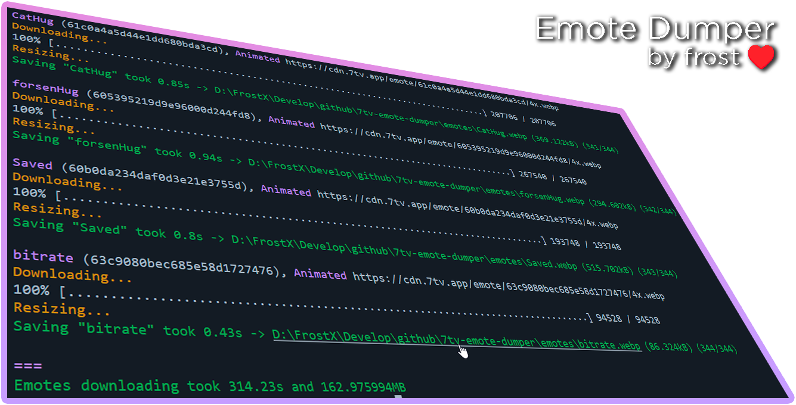

# 7TV Emote Dumper

7TV Emote Dumper by **frost** 
 GitHub: frostx-official 
 Discord: fsxg 
 Twitch: frostxoff 

Based on this code snippet — 
https://gist.github.com/a268e881f4ecf6cd1f2af5d4031e993d

All animated emotes will be converted to webp 
All static emotes will be converted to png

### Made for [Pepeland Community](https://pepeland.net)